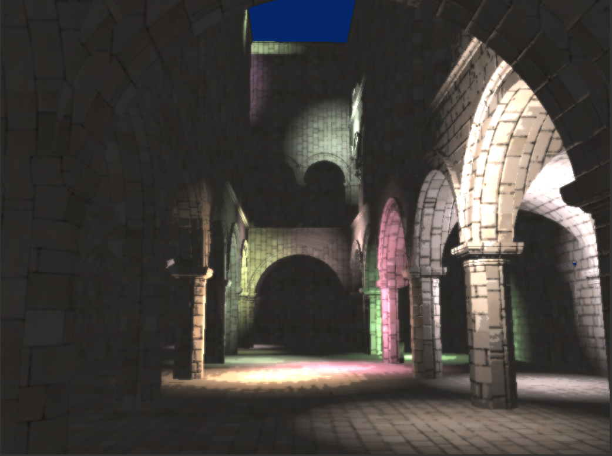
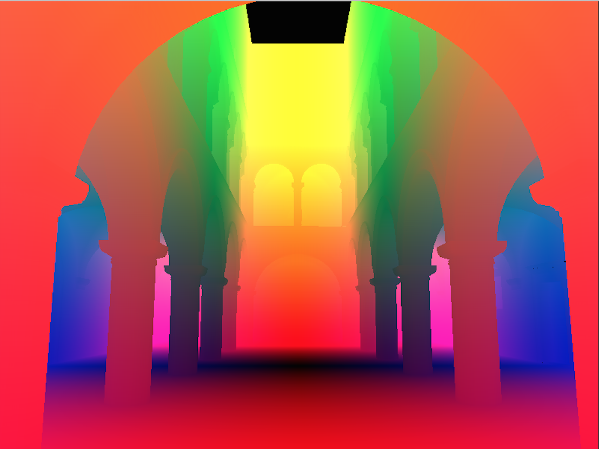
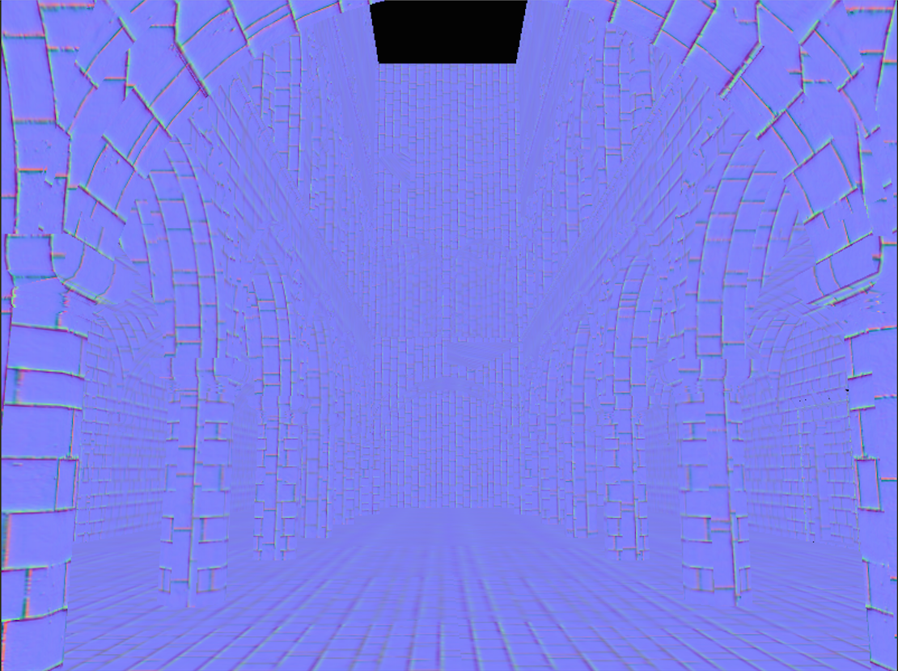

WebGL Deferred Shading
======================

**University of Pennsylvania, CIS 565: GPU Programming and Architecture, Project 6**

* Guan Sun
* Tested on: **Google Chrome 46.0.2490.80** on
  Windows 7, i7-4770 @ 3.40GHz 16GB, NVIDIA NVS 310 (Moore 100C Lab)

### Live Online

### Demo Video

## Project Description:
In this project, a a deferred shading pipeline and various lighting and visual effects are implemented using GLSL and WebGL.
The implemented features include,
* Effects:
  * Deferred Blinn-Phong shading (diffuse + specular) for point lights
  
  A standared Blinn-Phong sharder. Defferred means that no shading is actuaally performaed in the first pass of the vertex and pixel shaders, instdead shading is "deferred" untill a second pass. On the first pass, only data that is required for shading  computation is gathered and put into the geometry buffer(G-buffer). Then the sharder computs the lighting at each pixel using the information.

  * Bloom using post-process blur
  
  Blur using a 5*5 kernal in one single pass to simulate the bloom effect. This will slightly decrease the perfomance. Possible further improvement could be use a two-pass blur, this will require less computation.

  * Toon shading (with ramp shading + simple depth-edge detection for outlines)
  
  Toon shading using Sobel operator as an edge detector.

* Optimizations:
  * Scissor test optimization
  

* Debug views
  * Depth
  
  * Postiion
  
  * Geometry normal
  
  * Color map
  
  * Normal map
  
  * Surface normal
  

## Performance & Analysis
The rendering performance with and without scissor test optimization is,
* Without scissor test optimization: 17 FPS
* With scissor test optimization: 35 FPS

With the scissor test optimization, the performance is approximatly twice better. The reason for this is, with the optimizaiton, when accumulating shading from each point light source, only the rectangle around the light is rendered.