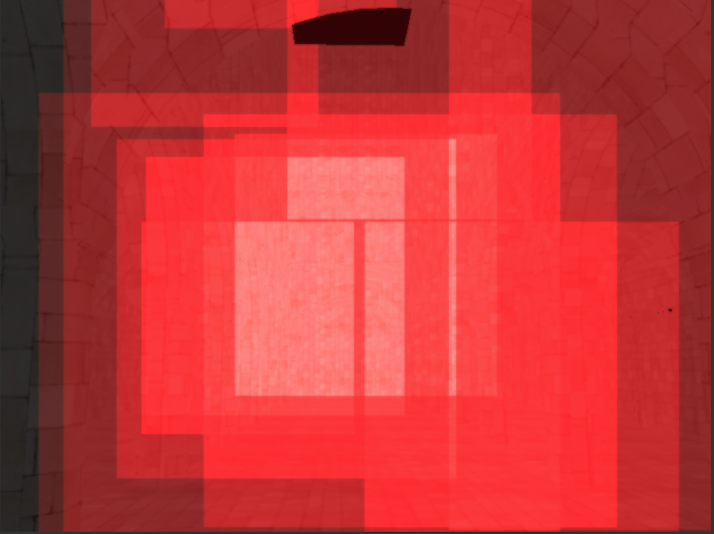
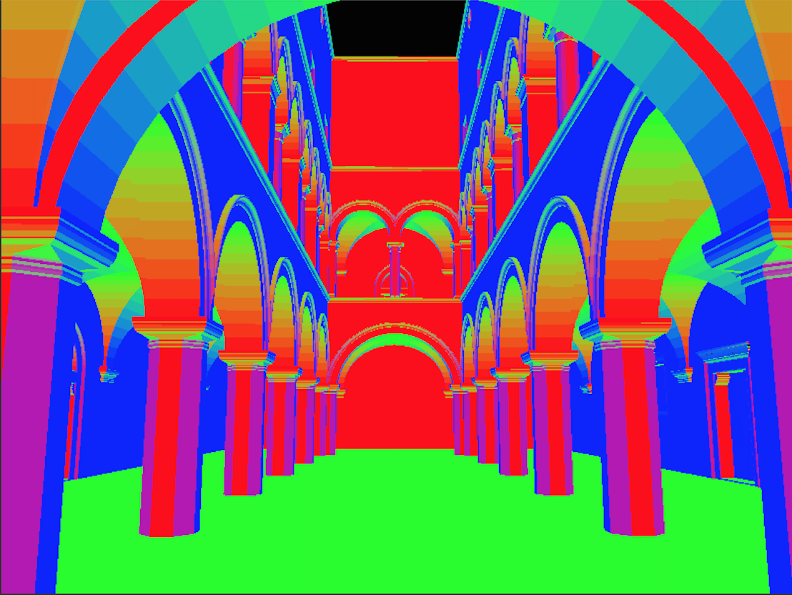
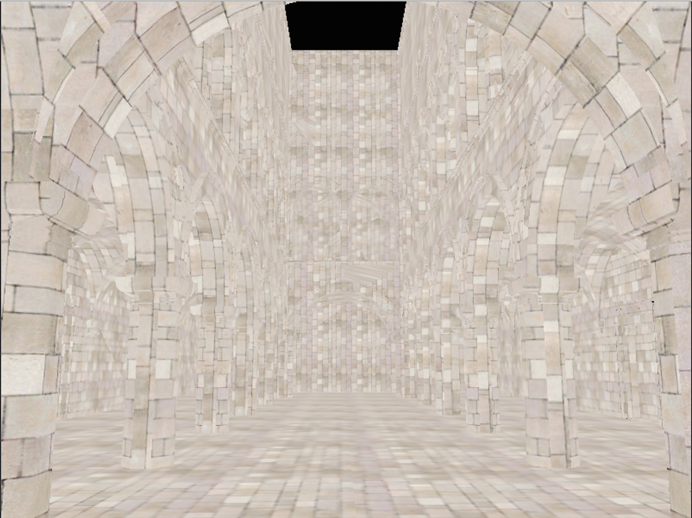
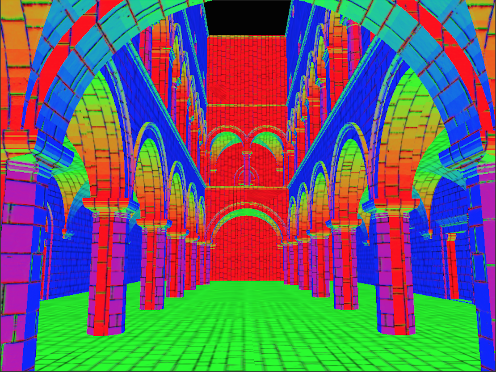

WebGL Deferred Shading
======================

**University of Pennsylvania, CIS 565: GPU Programming and Architecture, Project 6**

* Guan Sun
* Tested on: **Google Chrome 46.0.2490.80** on
  Windows 7, i7-4770 @ 3.40GHz 16GB, NVIDIA NVS 310 (Moore 100C Lab)

### Live Online

## Project Description:
In this project, a a deferred shading pipeline is implemented using GLSL and WebGL.
The implemented features include,
* Effects:
  * Deferred Blinn-Phong shading (diffuse + specular) for point lights
  

* Optimizations:
  * Scissor test optimization
  

* Debug views
  * Depth
  
  * Postiion
  
  * Geometry normal
  
  * Color map
  
  * Normal map
  
  * Surface normal
  

## Performance & Analysis
The rendering performance with and without scissor test optimization are,
* Without scissor test optimization: 17 FPS
* With scissor test optimization: 35 FPS

With the scissor test optimization, the performance is approximatly twice better. The reason for this is, with the optimizaiton, when accumulating shading from each point light source, only the rectangle around the light is rendered.