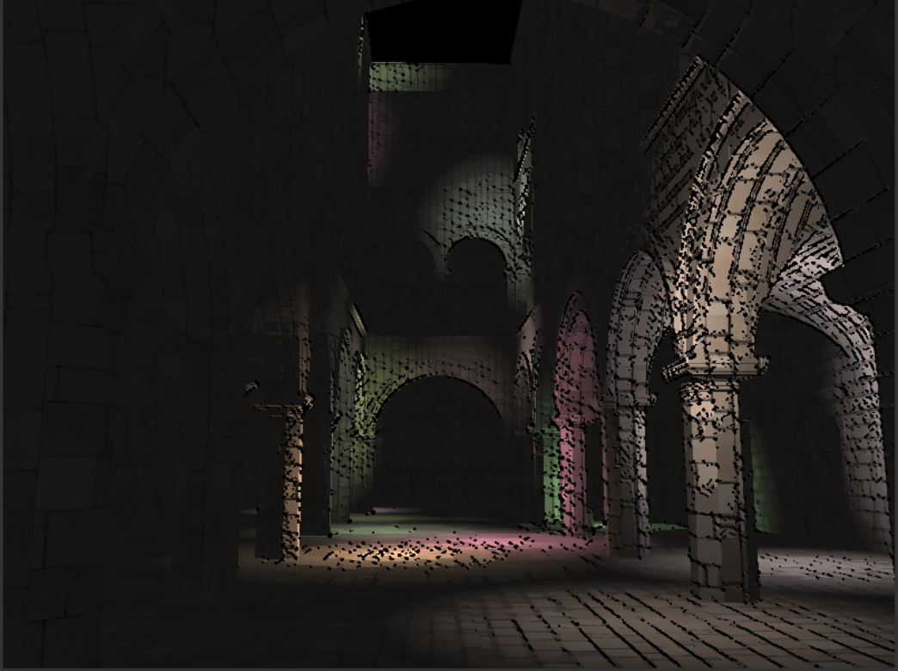
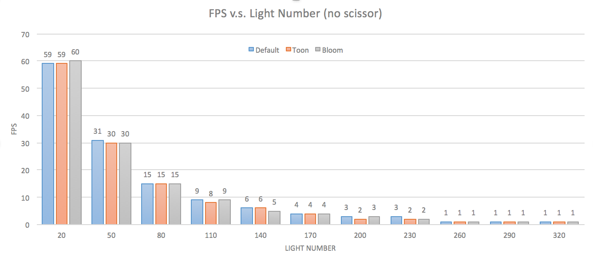
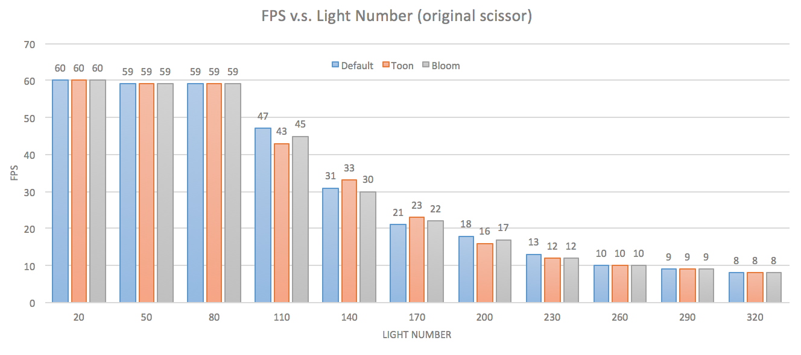
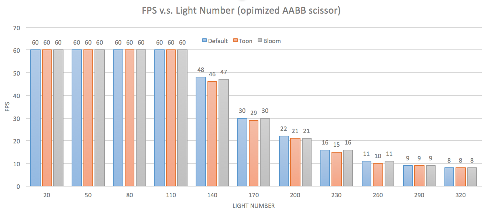

WebGL Deferred Shading
======================

**University of Pennsylvania, CIS 565: GPU Programming and Architecture, Project 6**

* Guan Sun
* Tested on: **Google Chrome 46.0.2490.80** on
  Windows 7, i7-4770 @ 3.40GHz 16GB, NVIDIA NVS 310 (Moore 100C Lab)

### Live Online

### Demo Video

## Project Description:
In this project, a a deferred shading pipeline and various lighting and visual effects are implemented using GLSL and WebGL.
The implemented features include,
* Effects:
  * Deferred Blinn-Phong shading (diffuse + specular) for point lights
  
  A standared Blinn-Phong sharder. Defferred means that no shading is actuaally performaed in the first pass of the vertex and pixel shaders, instdead shading is "deferred" untill a second pass. On the first pass, only data that is required for shading  computation is gathered and put into the geometry buffer(G-buffer). Then the sharder computs the lighting at each pixel using the information.

  * Bloom using post-process blur
  
  Blur using a 5*5 kernal in one single pass to simulate the bloom effect. This will slightly decrease the perfomance. Possible further improvement could be use a two-pass blur, this will require less computation.

  * Toon shading (with ramp shading + simple depth-edge detection for outlines)
  
  Toon shading using Sobel operator as an edge detector. This has minor impact on the perfomance.

* Optimizations:
  * Scissor Test
  
  When accumulating shading from each point light source, only render in a rectangle around the light. This will greatly imporve the perfomance.

  * Optimized AABB Scissor Test
  
  This generates smaller bounding boxes for the scissor test, thus further improves the perfomance.

* Debug views
  * Depth
  
  * Postiion
  
  * Geometry normal
  
  * Color map
  
  * Normal map
  
  * Surface normal
  

## Performance Comparison
* No Scissor

* Original Scissor

* AABB Scissor

## Resources

* [1] Bloom:
  [GPU Gems, Ch. 21](http://http.developer.nvidia.com/GPUGems/gpugems_ch21.html) 
* [2] Screen-Space Ambient Occlusion:
  [Floored Article](http://floored.com/blog/2013/ssao-screen-space-ambient-occlusion.html)
* [3] Post-Process Motion Blur:
  [GPU Gems 3, Ch. 27](http://http.developer.nvidia.com/GPUGems3/gpugems3_ch27.html)